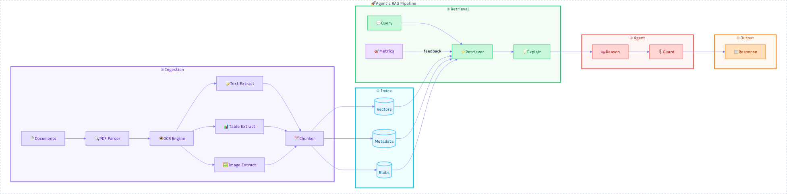
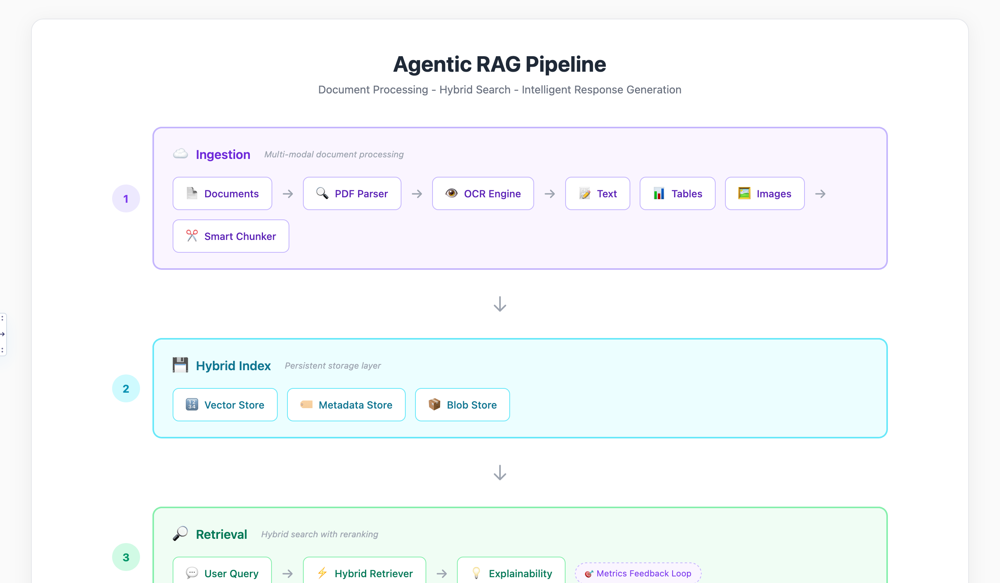
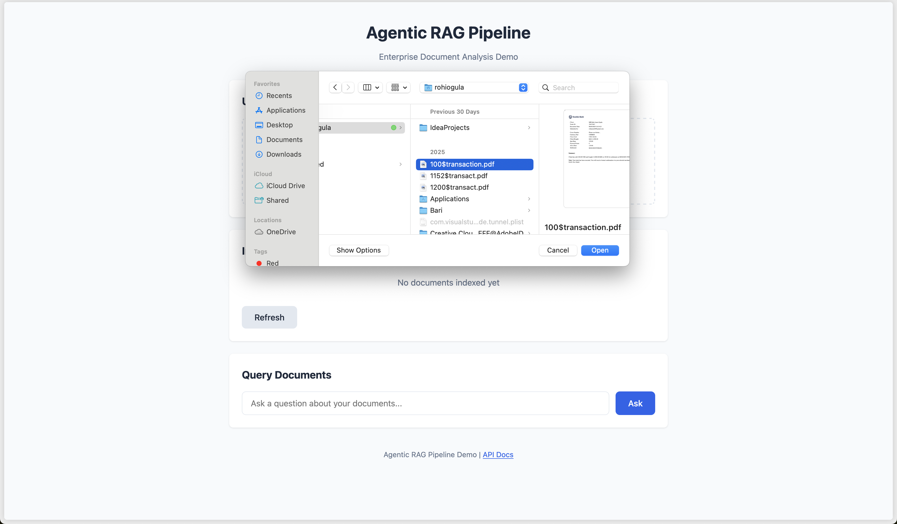
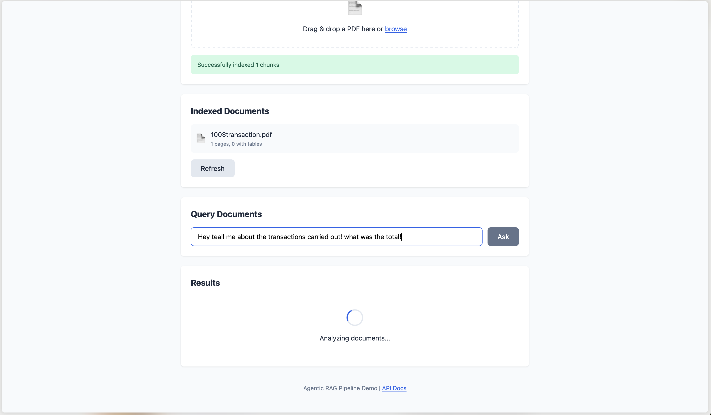
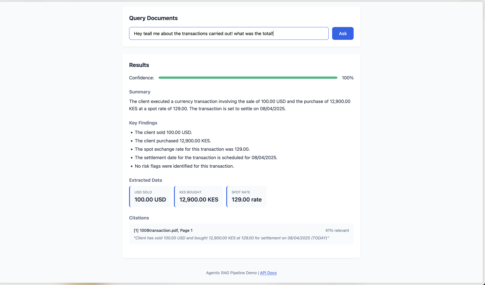

# Agentic RAG Pipeline

An enterprise-grade RAG (Retrieval-Augmented Generation) pipeline for analyzing unstructured documents including PDFs with tables, specifications, and financial data.

## Architecture




```
┌─────────────────────────────────────────────────────────────────────────┐
│                        AGENTIC RAG PIPELINE                              │
├─────────────────────────────────────────────────────────────────────────┤
│                                                                          │
│  ┌──────────────┐    ┌──────────────┐    ┌──────────────┐               │
│  │   PDF Docs   │───▶│  PDF Parser  │───▶│   Chunker    │               │
│  └──────────────┘    └──────────────┘    └──────────────┘               │
│         │                   │                   │                        │
│         │            ┌──────▼──────┐           │                        │
│         │            │ Table Extractor │        │                        │
│         │            │  (Vision LLM)   │        │                        │
│         │            └──────┬──────┘           │                        │
│         │                   │                   │                        │
│         │                   ▼                   ▼                        │
│         │            ┌─────────────────────────────┐                    │
│         │            │      HYBRID INDEX           │                    │
│         │            │  ┌─────────┐ ┌──────────┐  │                    │
│         │            │  │ Vector  │ │ Metadata │  │                    │
│         │            │  │  Store  │ │  Store   │  │                    │
│         │            │  └─────────┘ └──────────┘  │                    │
│         │            └─────────────────────────────┘                    │
│         │                          │                                     │
│         │                          ▼                                     │
│         │            ┌─────────────────────────────┐                    │
│  User   │            │    HYBRID RETRIEVER         │                    │
│  Query ─┼───────────▶│  • Semantic Search          │                    │
│         │            │  • Metadata Filtering       │                    │
│         │            │  • Explainability           │                    │
│         │            └─────────────────────────────┘                    │
│         │                          │                                     │
│         │                          ▼                                     │
│         │            ┌─────────────────────────────┐                    │
│         │            │    REASONING AGENT          │                    │
│         │            │  • Chain-of-Thought         │                    │
│         │            │  • Citation Generation      │                    │
│         │            │  • Policy Guardrails        │                    │
│         │            └─────────────────────────────┘                    │
│         │                          │                                     │
│         │                          ▼                                     │
│         │            ┌─────────────────────────────┐                    │
│         ◀────────────│   STRUCTURED OUTPUT         │                    │
│                      │  • JSON + Citations         │                    │
│                      │  • Risk Flags               │                    │
│                      │  • Key Findings             │                    │
│                      └─────────────────────────────┘                    │
│                                                                          │
└─────────────────────────────────────────────────────────────────────────┘
```

## Quick Start

```bash
# Clone and setup
cd agentic-rag
uv sync

# Set OpenAI API key
export OPENAI_API_KEY="your-key"

# Generate sample PDFs
uv run python scripts/generate_sample_pdfs.py

# Run the demo notebook
uv run jupyter notebook notebooks/demo.ipynb
```

---

## Web UI

A visual interface is available for demos and testing.

### Running the Server

```bash
uv run python main.py
```

Then open:
- **Frontend**: http://localhost:8000
- **API Docs**: http://localhost:8000/docs

### Features

- **Drag & drop PDF upload** with progress indicator
- **Query interface** with natural language input
- **Results display** showing:
  - Summary and key findings
  - Extracted data with units
  - Risk flags (color-coded by severity)
  - Citations with source file, page, and relevance
  - Confidence score

---

## API Reference

### Health Check

```bash
curl http://localhost:8000/api/health
```

Response:
```json
{
  "status": "healthy",
  "timestamp": "2026-01-21T10:30:00Z",
  "index_stats": {
    "total_chunks": 15,
    "text_chunks": 12,
    "table_chunks": 3,
    "indexed_documents": ["technical_report.pdf"]
  }
}
```

### Upload Document

```bash
curl -X POST http://localhost:8000/api/documents/upload \
  -F "file=@document.pdf"
```



Response:
```json
{
  "success": true,
  "filename": "document.pdf",
  "message": "Successfully indexed 5 chunks",
  "document_info": {
    "filename": "document.pdf",
    "total_pages": 2,
    "pages_with_tables": 1,
    "chunks_indexed": 5,
    "indexed_at": "2026-01-21T10:30:00Z"
  }
}
```

### List Documents

```bash
curl http://localhost:8000/api/documents/list
```

### Query Documents

```bash
curl -X POST http://localhost:8000/api/query/ \
  -H "Content-Type: application/json" \
  -d '{
    "query": "What is the maximum operating temperature?",
    "n_chunks": 5,
    "apply_guardrails": true
  }'
```





Response:
```json
{
  "query": "What is the maximum operating temperature?",
  "summary": "The maximum operating temperature is 80°C...",
  "key_findings": [
    "Maximum operating temperature: 80°C",
    "Automatic shutdown triggers at 85°C"
  ],
  "extracted_data": {
    "max_temperature": {"value": "80", "unit": "°C", "source": 1}
  },
  "risk_flags": [],
  "citations": [
    {
      "id": 1,
      "source_file": "technical_report.pdf",
      "page": 1,
      "chunk_type": "text",
      "relevance": 0.95,
      "excerpt": "Maximum Temperature: 80°C (CRITICAL)..."
    }
  ],
  "confidence_score": 0.92,
  "metadata": {"model": "gpt-4o", "chunks_retrieved": 5}
}
```

### Clear Index

```bash
curl -X POST http://localhost:8000/api/documents/clear
```

---

## Project Structure

```
agentic-rag/
├── src/
│   ├── ingestion/
│   │   ├── pdf_parser.py       # PDF text/image extraction
│   │   └── table_extractor.py  # Vision LLM table extraction
│   ├── indexing/
│   │   ├── chunker.py          # Semantic chunking strategies
│   │   └── hybrid_index.py     # ChromaDB vector + metadata
│   ├── retrieval/
│   │   └── hybrid_retriever.py # Search with explainability
│   ├── agent/
│   │   ├── reasoning.py        # Chain-of-thought reasoning
│   │   └── guardrails.py       # Policy-based safety checks
│   └── output/
│       └── synthesizer.py      # Structured JSON output
├── notebooks/
│   └── demo.ipynb              # Full pipeline demo
├── scripts/
│   └── generate_sample_pdfs.py # Sample document generator
└── data/pdfs/                  # Sample documents
```

---

## Design Decisions

### 1. Chunking Design for Tables

**Problem**: Traditional chunking splits text at arbitrary boundaries, which destroys table semantics.

**Solution**: Tables are treated as **atomic units** and never split.

```python
# From src/indexing/chunker.py

def chunk_table(self, table_json, table_summary, ...):
    """
    Tables are NEVER split. Instead, we create a single chunk
    with the summary text for semantic search, and store the full
    structured data in metadata for precise retrieval.
    """
    # Searchable text for embedding
    text_repr = f"Table: {table_summary}\n"
    text_repr += f"Columns: {', '.join(headers)}\n"
    # Include first few rows as context
    for i, row in enumerate(rows[:3]):
        text_repr += f"Row {i+1}: {' | '.join(str(v) for v in row)}\n"

    return Chunk(
        content=text_repr,           # For semantic search
        structured_data=table_json,  # Full data preserved
    )
```

**Key principles**:
- **Text representation**: Table summary + headers + sample rows for embedding
- **Structured storage**: Full JSON preserved separately for precise queries
- **Dual retrieval**: Search finds tables semantically, structured data enables exact lookups

**Text chunking** uses semantic boundaries:
1. Split on paragraph boundaries (double newlines)
2. Merge small paragraphs up to chunk_size
3. Split large paragraphs at sentence boundaries
4. Add overlap between chunks for context continuity

---

### 2. Retrieval Decision Process

**Hybrid retrieval** combines multiple signals:

```
Query → [Semantic Search] → [Metadata Filter] → [Relevance Scoring] → [Explainability] → Results
```

**Step 1: Semantic Search**
```python
# Vector similarity using OpenAI embeddings
query_embedding = get_embedding(query)
results = chromadb.query(query_embedding, n=n_results*2)  # Over-fetch
```

**Step 2: Metadata Filtering**
```python
# Filter by chunk type, source file, etc.
where_filter = {"chunk_type": "table", "source_file": "specs.pdf"}
```

**Step 3: Relevance Threshold**
```python
# Only keep chunks above relevance threshold
filtered = [c for c in chunks if c.relevance_score >= 0.3]
```

**Step 4: Explainability**
Each chunk gets an LLM-generated explanation:
```python
RELEVANCE_PROMPT = """
Query: {query}
Chunk: {content}

Explain why this chunk is relevant (or say NOT_RELEVANT).
"""
```

**Why this approach**:
- Over-fetching + filtering reduces false negatives
- Metadata filters enable precise retrieval when needed
- Explainability helps debugging and user trust
- NOT_RELEVANT filtering catches semantic search mistakes

---

### 3. Hallucination Prevention

Multiple layers of defense:

**Layer 1: Strict Grounding Prompt**
```python
REASONING_PROMPT = """
CRITICAL RULES:
1. ONLY use information from the provided context
2. If the context doesn't contain enough information,
   say "I cannot find this information in the provided documents"
3. ALWAYS cite your sources using [Source N] notation
"""
```

**Layer 2: Citation Requirement**
Every claim must have a source reference. The output format enforces this:
```json
{
  "answer": "The max temp is 80°C [Source 1]",
  "citations": [
    {"source_num": 1, "file": "specs.pdf", "page": 2, "quote": "..."}
  ]
}
```

**Layer 3: Retrieval-Based Filtering**
Chunks marked NOT_RELEVANT by the explainability check are removed before reasoning.

**Layer 4: Confidence Scoring**
Low confidence answers (< 0.5) are flagged for human review.

**Layer 5: Source Verification**
Citations are validated against actual retrieved chunks:
```python
def _enhance_citations(self, citations, retrieval_result):
    # Map [Source N] back to actual files/pages
    for citation in citations:
        chunk = retrieval_result.chunks[citation["source_num"] - 1]
        citation["file"] = chunk.source_file  # Actual source
```

---

### 4. Scaling to Millions of Documents

**Current architecture limitations**:
- In-memory ChromaDB (demo mode)
- Synchronous processing
- Single-node execution

**Production scaling approach**:

```
                    ┌─────────────────────────────────────────┐
                    │           LOAD BALANCER                  │
                    └─────────────────────────────────────────┘
                                      │
              ┌───────────────────────┼───────────────────────┐
              │                       │                       │
              ▼                       ▼                       ▼
    ┌─────────────────┐   ┌─────────────────┐   ┌─────────────────┐
    │   API Server 1  │   │   API Server 2  │   │   API Server N  │
    └─────────────────┘   └─────────────────┘   └─────────────────┘
              │                       │                       │
              └───────────────────────┼───────────────────────┘
                                      │
    ┌─────────────────────────────────┼─────────────────────────────────┐
    │                                 ▼                                 │
    │  ┌──────────────┐    ┌──────────────┐    ┌──────────────┐        │
    │  │   Pinecone   │    │  PostgreSQL  │    │    Redis     │        │
    │  │   (Vectors)  │    │  (Metadata)  │    │   (Cache)    │        │
    │  └──────────────┘    └──────────────┘    └──────────────┘        │
    │                         DATA LAYER                                │
    └───────────────────────────────────────────────────────────────────┘
```

**Key changes**:

| Component | Demo | Production |
|-----------|------|------------|
| Vector DB | ChromaDB (local) | Pinecone / Weaviate / pgvector |
| Metadata | In-memory dict | PostgreSQL + Redis cache |
| Ingestion | Synchronous | Async workers (Celery/Ray) |
| Embeddings | OpenAI API | Batch API + caching |

**Ingestion at scale**:
```python
# Parallel document processing
async def ingest_batch(pdf_paths: list[Path]):
    async with asyncio.TaskGroup() as tg:
        for path in pdf_paths:
            tg.create_task(process_single_pdf(path))

# Batch embeddings (cheaper, faster)
embeddings = openai.embeddings.create(
    model="text-embedding-3-small",
    input=texts,  # Up to 2048 texts per batch
)
```

**Query optimization**:
1. **Embedding cache**: Store query embeddings in Redis
2. **Result cache**: Cache frequent query results (TTL-based)
3. **Approximate search**: Use HNSW with lower ef_search for speed
4. **Hybrid scoring**: Pre-compute BM25 scores for keyword boosting

**Cost estimates** (1M documents):
- Storage: ~$50/month (Pinecone Starter)
- Embeddings: ~$40 one-time (text-embedding-3-small)
- Queries: ~$0.0001/query (cached embeddings)

---

### 5. On-Premises Enterprise Deployment

**Key requirements**:
- No data leaves the network
- Air-gapped deployment option
- Integration with existing auth/audit systems
- Compliance (SOC2, HIPAA, etc.)

**Architecture adjustments**:

```
┌─────────────────────────────────────────────────────────────────────┐
│                    ENTERPRISE KUBERNETES CLUSTER                     │
├─────────────────────────────────────────────────────────────────────┤
│                                                                      │
│  ┌────────────────────────────────────────────────────────────┐     │
│  │                    INGRESS (NGINX/Traefik)                  │     │
│  │                    + mTLS + OIDC Auth                       │     │
│  └────────────────────────────────────────────────────────────┘     │
│                                │                                     │
│           ┌────────────────────┼────────────────────┐               │
│           │                    │                    │               │
│           ▼                    ▼                    ▼               │
│  ┌─────────────────┐  ┌─────────────────┐  ┌─────────────────┐     │
│  │  RAG API Pod    │  │  RAG API Pod    │  │  RAG API Pod    │     │
│  │  (Replicas: 3)  │  │                 │  │                 │     │
│  └─────────────────┘  └─────────────────┘  └─────────────────┘     │
│           │                                                          │
│           ▼                                                          │
│  ┌─────────────────────────────────────────────────────────────┐    │
│  │                    LOCAL LLM CLUSTER                         │    │
│  │  ┌──────────────┐  ┌──────────────┐  ┌──────────────┐       │    │
│  │  │  vLLM Node   │  │  vLLM Node   │  │  vLLM Node   │       │    │
│  │  │ (Llama 3 70B)│  │              │  │              │       │    │
│  │  └──────────────┘  └──────────────┘  └──────────────┘       │    │
│  └─────────────────────────────────────────────────────────────┘    │
│           │                                                          │
│           ▼                                                          │
│  ┌─────────────────────────────────────────────────────────────┐    │
│  │                    DATA LAYER                                │    │
│  │  ┌──────────────┐  ┌──────────────┐  ┌──────────────┐       │    │
│  │  │  pgvector    │  │  PostgreSQL  │  │   MinIO      │       │    │
│  │  │  (Vectors)   │  │  (Metadata)  │  │  (PDFs)      │       │    │
│  │  └──────────────┘  └──────────────┘  └──────────────┘       │    │
│  └─────────────────────────────────────────────────────────────┘    │
│                                                                      │
└─────────────────────────────────────────────────────────────────────┘
```

**Component swaps**:

| Cloud | On-Prem Alternative |
|-------|---------------------|
| OpenAI GPT-4 | vLLM + Llama 3 / Qwen2 |
| OpenAI Embeddings | sentence-transformers (local) |
| Pinecone | pgvector / Milvus |
| S3 | MinIO |

**Code changes for local models**:

```python
# Switch to local embeddings
from sentence_transformers import SentenceTransformer

class LocalEmbeddings:
    def __init__(self, model_name="BAAI/bge-large-en-v1.5"):
        self.model = SentenceTransformer(model_name)

    def embed(self, texts: list[str]) -> list[list[float]]:
        return self.model.encode(texts).tolist()

# Switch to local LLM via vLLM
from openai import OpenAI

client = OpenAI(
    base_url="http://vllm-service:8000/v1",  # Local vLLM
    api_key="not-needed"
)
```

**Security considerations**:
1. **Network isolation**: Deploy in private subnet
2. **Encryption**: TLS for transit, encryption at rest for pgvector
3. **Auth**: OIDC integration (Okta, AD)
4. **Audit**: Log all queries and responses
5. **Data retention**: Configurable TTL for stored documents

**Resource requirements** (1M documents):
- 3x API servers: 4 CPU, 8GB RAM each
- 3x vLLM nodes: 8 CPU, 80GB RAM, 1x A100 GPU each
- PostgreSQL: 16 CPU, 64GB RAM, 500GB NVMe
- Total: ~$15-20k/month (cloud GPUs) or $100k+ (on-prem hardware)

---

## Sample Output

```json
{
  "query": "What is the current operating temperature and is it safe?",
  "summary": "The equipment is operating at 72°C, approaching the 80°C safety limit.",
  "key_findings": [
    "Current temperature is 72°C (90% of max limit)",
    "Automatic shutdown triggers at 85°C",
    "Cooling system inspection recommended"
  ],
  "extracted_data": {
    "temperature": {"value": "72", "unit": "°C", "source": 1},
    "max_temperature": {"value": "80", "unit": "°C", "source": 1}
  },
  "risk_flags": [
    {
      "metric": "temperature",
      "value": "72 °C",
      "limit": "80 °C",
      "severity": "warning",
      "message": "Temperature approaching critical threshold"
    }
  ],
  "citations": [
    {
      "id": 1,
      "source_file": "technical_report.pdf",
      "page": 1,
      "excerpt": "Maximum Temperature: 80°C (CRITICAL)..."
    }
  ],
  "confidence_score": 0.92
}
```

---

## License

MIT
